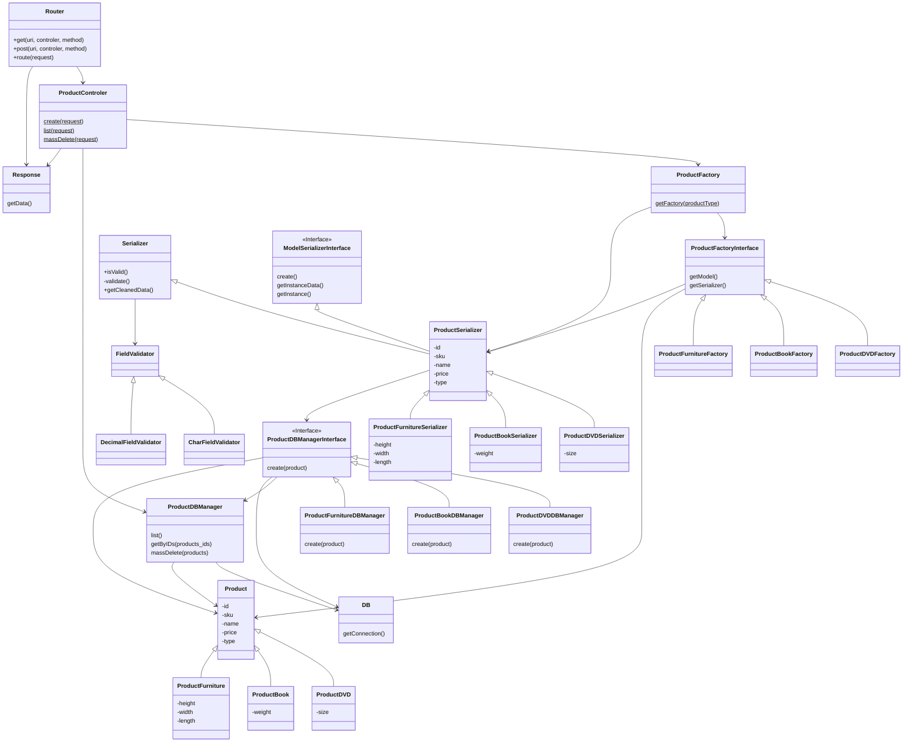

```mermaid
classDiagram
    Product <|-- ProductDVD
    Product <|-- ProductBook
    Product <|-- ProductFurniture
    ProductControler --> ProductFactory
    ProductFactoryInterface <|-- ProductDVDFactory
    ProductFactoryInterface <|-- ProductBookFactory
    ProductFactoryInterface <|-- ProductFurnitureFactory
    ProductFactory --> ProductFactoryInterface
    ProductFactoryInterface --> Product
    ProductFactoryInterface --> ProductSerializer
    Serializer <|-- ProductSerializer
    ProductSerializer <|-- ProductDVDSerializer
    ProductSerializer <|-- ProductBookSerializer
    ProductSerializer <|-- ProductFurnitureSerializer
    ProductFactory --> ProductSerializer
    ModelSerializerInterface <|-- ProductSerializer
    ProductDBManager --> DB
    ProductControler --> ProductDBManager
    ProductDBManagerInterface <|-- ProductDVDDBManager
    ProductDBManagerInterface <|-- ProductBookDBManager
    ProductDBManagerInterface <|-- ProductFurnitureDBManager
    ProductSerializer --> ProductDBManagerInterface
    ProductDBManagerInterface --> ProductDBManager
    ProductDBManagerInterface --> DB
    Router --> ProductControler
    ProductControler --> Response
    Router --> Response
    FieldValidator <|-- CharFieldValidator
    FieldValidator <|-- DecimalFieldValidator
    Serializer --> FieldValidator
    ProductDBManager --> Product
    ProductDBManagerInterface --> Product

    class ProductControler{
        create(request)$
        list(request)$
        massDelete(request)$
    }
    class ProductFactory{
        getFactory(productType)$
    }
    class ProductFactoryInterface{
        getModel()
        getSerializer()
    }
    class ProductDVDFactory{

    }
    class ProductBookFactory{

    }
    class ProductFurnitureFactory{

    }
    class Product{
        -id
        -sku
        -name
        -price
        -type
    }
    class ProductDVD{
        -size
    }
    class ProductBook{
        -weight
    }
    class ProductFurniture{
        -height
        -width
        -length
    }
    class Serializer{
        +isValid()
        -validate()
        +getCleanedData()
    }
    class ProductSerializer{
        -id
        -sku
        -name
        -price
        -type
    }
    class ProductDVDSerializer{
        -size
    }
    class ProductBookSerializer{
        -weight
    }
    class ProductFurnitureSerializer{
        -height
        -width
        -length
    }
    class ModelSerializerInterface{
        <<Interface>>
        create()
        getInstanceData()
        getInstance()
    }
    class DB{
        getConnection()
    }
    class ProductDBManager{
        list()
        getByIDs(products_ids)
        massDelete(products)
    }

    class ProductDBManagerInterface{
        <<Interface>>
        create(product)
    }
    class ProductDVDDBManager{
        create(product)
    }
    class ProductBookDBManager{
        create(product)
    }
    class ProductFurnitureDBManager{
        create(product)
    }
    class Router{
        +get(uri, controler, method)
        +post(uri, controler, method)
        +route(request)
    }
    class Response{
        getData()
    }

    class FieldValidator{

    }
    class CharFieldValidator{

    }
    class DecimalFieldValidator{

    }
```
