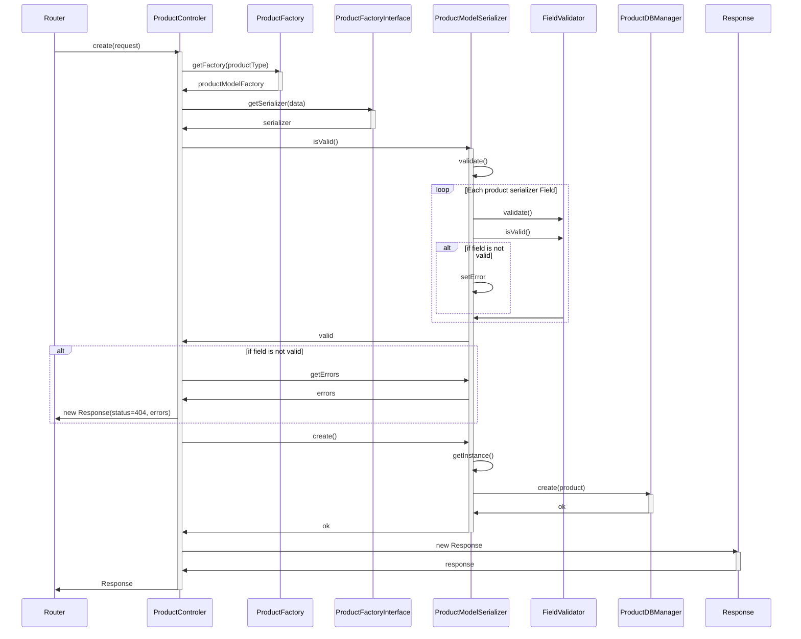

```mermaid

sequenceDiagram
    Router->>ProductControler: create(request)
    activate ProductControler
    ProductControler->>ProductFactory: getFactory(productType)
    activate ProductFactory
    ProductFactory->>ProductControler: productModelFactory
    deactivate ProductFactory

    ProductControler->>ProductFactoryInterface: getSerializer(data)
    activate ProductFactoryInterface

    ProductFactoryInterface->>ProductControler: serializer
    deactivate ProductFactoryInterface

    ProductControler->>ProductModelSerializer : isValid()
    activate ProductModelSerializer

    ProductModelSerializer->>ProductModelSerializer: validate()

    loop Each product serializer Field
        ProductModelSerializer->>FieldValidator : validate()
        ProductModelSerializer->>FieldValidator : isValid()
        alt if field is not valid
            ProductModelSerializer->>ProductModelSerializer : setError
        end
        FieldValidator->>ProductModelSerializer : 
    end


    ProductModelSerializer->>ProductControler: valid

    alt if field is not valid
        ProductControler->>ProductModelSerializer : getErrors
        ProductModelSerializer->>ProductControler : errors
        ProductControler->>Router : new Response(status=404, errors)
    end

    ProductControler->>ProductModelSerializer: create()
    
    ProductModelSerializer->>ProductModelSerializer : getInstance()
    ProductModelSerializer->>ProductDBManager : create(product)
    activate ProductDBManager
    ProductDBManager->>ProductModelSerializer : ok
    deactivate ProductDBManager

    ProductModelSerializer->>ProductControler : ok
    deactivate ProductModelSerializer

    ProductControler ->> Response : new Response
    activate Response
    Response ->> ProductControler : response
    deactivate Response

    ProductControler->>Router: Response
    deactivate ProductControler


```
