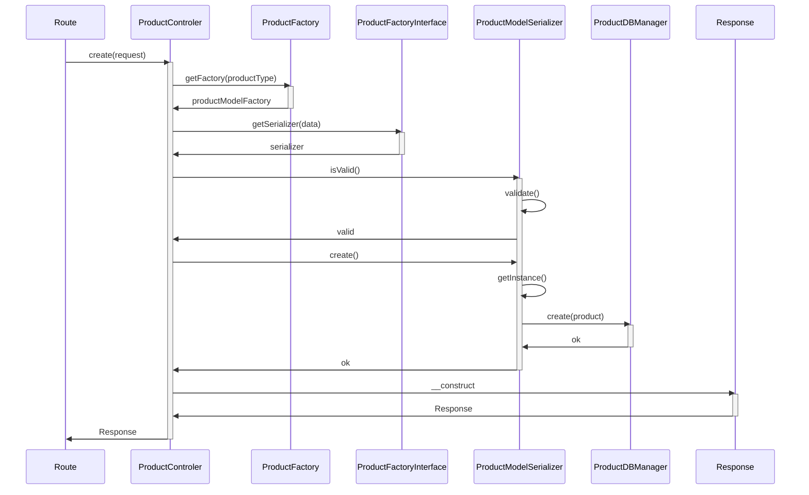

```mermaid

sequenceDiagram
    Route->>ProductControler: create(request)
    activate ProductControler
    ProductControler->>ProductFactory: getFactory(productType)
    activate ProductFactory
    ProductFactory->>ProductControler: productModelFactory
    deactivate ProductFactory

    ProductControler->>ProductFactoryInterface: getSerializer(data)
    activate ProductFactoryInterface

    ProductFactoryInterface->>ProductControler: serializer
    deactivate ProductFactoryInterface

    ProductControler->>ProductModelSerializer : isValid()
    activate ProductModelSerializer

    ProductModelSerializer->>ProductModelSerializer: validate()
    ProductModelSerializer->>ProductControler: valid

    ProductControler->>ProductModelSerializer: create()
    
    ProductModelSerializer->>ProductModelSerializer : getInstance()
    ProductModelSerializer->>ProductDBManager : create(product)
    activate ProductDBManager
    ProductDBManager->>ProductModelSerializer : ok
    deactivate ProductDBManager

    ProductModelSerializer->>ProductControler : ok
    deactivate ProductModelSerializer

    ProductControler ->> Response : __construct
    activate Response
    Response ->> ProductControler : Response
    deactivate Response

    ProductControler->>Route: Response
    deactivate ProductControler


```
