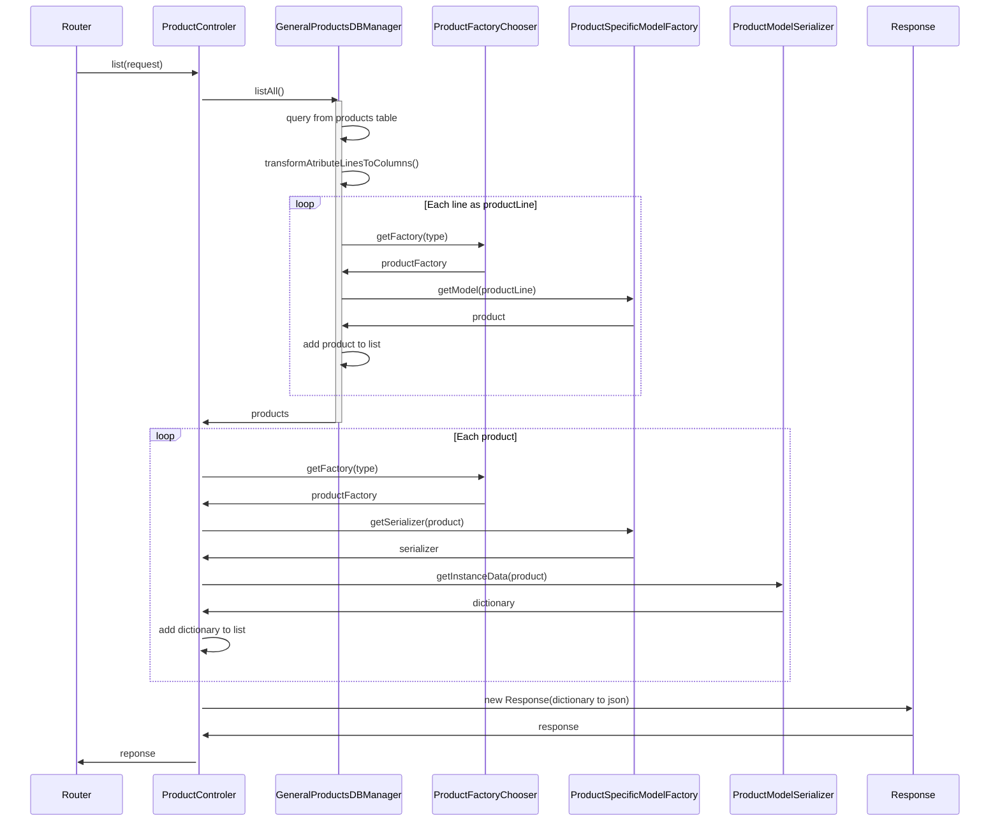

```mermaid

sequenceDiagram
    Router->>ProductControler : list(request)
    activate ProductControler
    
    ProductControler->>GeneralProductsDBManager : listAll()
    activate GeneralProductsDBManager

    GeneralProductsDBManager->>GeneralProductsDBManager : query from products table

    GeneralProductsDBManager->>GeneralProductsDBManager : transformAtributeLinesToColumns()

    loop Each line as productLine
        GeneralProductsDBManager->>ProductFactoryChooser : getFactory(type)
        ProductFactoryChooser->>GeneralProductsDBManager : productFactory

        GeneralProductsDBManager ->> ProductSpecificModelFactory : getModel(productLine)
        ProductSpecificModelFactory ->> GeneralProductsDBManager : product
        GeneralProductsDBManager->>GeneralProductsDBManager : add product to list
    end
    GeneralProductsDBManager->>ProductControler : products
    deactivate GeneralProductsDBManager


    loop Each product
        ProductControler->>ProductFactoryChooser : getFactory(type)
        ProductFactoryChooser->>ProductControler : productFactory
        ProductControler->>ProductSpecificModelFactory : getSerializer(product)
        ProductSpecificModelFactory->>ProductControler : serializer

        ProductControler->>ProductModelSerializer : getInstanceData(product)
        ProductModelSerializer->>ProductControler : dictionary
        ProductControler->>ProductControler : add dictionary to list
    end
    ProductControler->>Response : new Response(dictionary to json)
    Response->>ProductControler : response
    ProductControler->>Router : reponse


```
