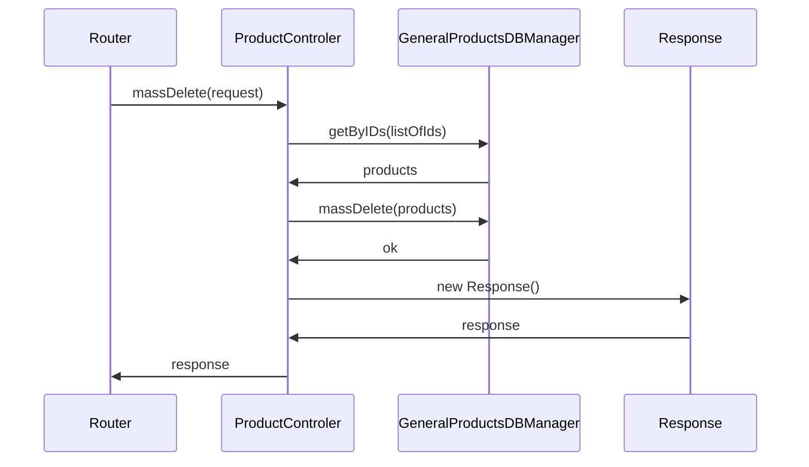

```mermaid

sequenceDiagram
    Router->>ProductControler : massDelete(request)

    ProductControler->>GeneralProductsDBManager : getByIDs(listOfIds)
    GeneralProductsDBManager->>ProductControler : products

    ProductControler->>GeneralProductsDBManager : massDelete(products)
    GeneralProductsDBManager->>ProductControler : ok

    ProductControler->>Response : new Response()
    Response->>ProductControler : response

    ProductControler->>Router : response


```
